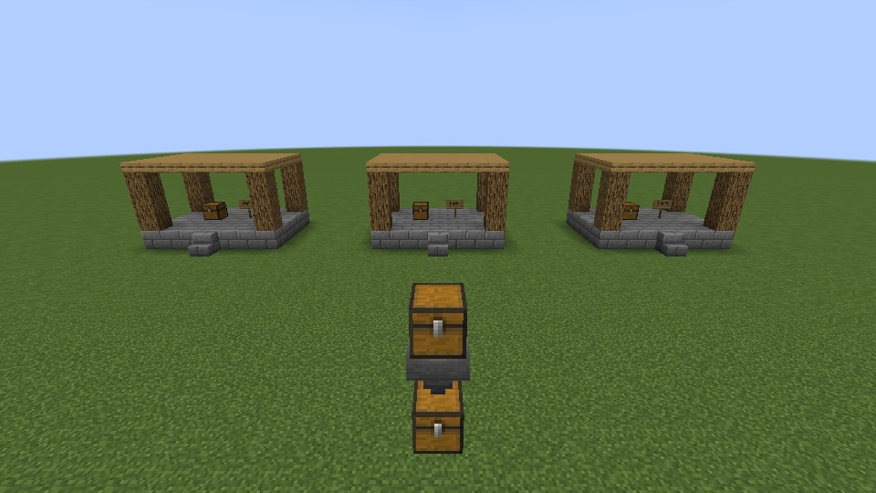

# VoxelProbe · 方块探针


**1.0.0 — Minecraft 1.20.1 / Forge 47.4.23 / Java 17**

VoxelProbe connects local MCP clients and a Python CLI to a running Minecraft world. Inspect authoritative integrated-server blocks, block-entity NBT and entities; sample machines at server tick boundaries; preview and apply bounded edits; run trusted Groovy against mapped game objects; and check the actual rendered frame. A small building codec reads and writes `.litematic`, Sponge v2 `.schem` and vanilla structure `.nbt` files.

This release targets **local single-player worlds with an integrated server**. Its game validation uses Windows, Minecraft 1.20.1, Forge 47.4.23 and Java 17. Other operating systems, Minecraft versions, loaders, dedicated servers and mod combinations are outside that tested compatibility target. It is a development and building tool, not a player-control bot or remote-server administration system. WorldEdit is optional.

## Install and pair

1. Install the full `voxelprobe-1.20.1-forge-1.0.0.jar` in the intended Forge instance's `mods/` directory. Do not use a `-slim.jar`. The internal mod ID remains `debugbridge` and the Java namespace remains `com.debugbridge` for compatibility; **do not install another DebugBridge JAR alongside it**.
2. Extract the companion tools package, retaining this layout:

   ```text
   README.md
   LICENSE
   NOTICE
   asset/icon.png
   asset/demo.jpg
   tool/
     install.py
     mc.py
     building.py
     requirements.lock
     example_build.json
     skills/
       voxelprobe-inspect/SKILL.md
       voxelprobe-build/SKILL.md
   ```

3. With **Python 3.11 or newer**, run from the extracted package directory. Replace `<instance>` with the directory containing that instance's `mods/` and `config/` directories:

   ```powershell
   python tool/install.py --game-dir '<instance>' --client codex --install-skills
   ```

   The installer creates **this package's `tool/.venv`** and installs the pinned Python dependencies there. `--client codex` explicitly registers the `voxelprobe` stdio MCP server using the Codex CLI on PATH; `--install-skills` copies the two bundled skills to the configured Codex home, preserving existing same-name skills. Open a new chat to load the MCP tools. For another stdio MCP client, omit `--client codex` and use the generic configuration printed by the installer. Omit `--install-skills` if you do not want skills installed.

4. Start that Minecraft instance. At the first welcome screen choose **Start inspection**; the bridge stays inactive until enabled and starts in **read-only mode**. Open a local world. `/voxelprobe status` shows the mode and local address; `/voxelprobe pair` explains local pairing.
5. Call `minecraft_read(operation="status")` and confirm `bridge.gameDir`, the version, and the intended `world` before editing.

Pairing uses the instance's private `config/debugbridge-connection.json`. The tools read its selected port, instance identity and access token through `MINECRAFT_GAME_DIR`, or the CLI's `--game-dir` option. **Do not share this file, print its token, or paste the token into MCP configuration or chat.** The bridge listens on `127.0.0.1` and rejects browser Origin connections; keep it local. The normal starting port is 9876, but pairing uses the actual port from the connection file.

## Permissions and target checks

Enter permission changes yourself in Minecraft:

| In-game command | Access |
|---|---|
| `/voxelprobe permissions read` | Inspection, screenshots and read-only previews; no world edits, commands or Groovy. Tick observation can start/stop in this mode. |
| `/voxelprobe permissions edit` | Also enables world changes and commands, including the client `runCommand` endpoint. Groovy stays disabled. |
| `/voxelprobe permissions script` | Also enables trusted server/client Groovy with full JVM access. |

**Script mode grants the Minecraft process's permissions, including filesystem reads and writes.** Only connect tools and scripts you trust. The timeout uses cooperative checks; it is not a security sandbox and cannot reliably interrupt native or blocking calls. Keep `sync { ... }` work bounded so the game thread can continue. A timed-out request may already have changed the world: read back before deciding whether to retry.

The companion tools bind mutations to the current `instance_id` and `world_id`. Read status before a change and refresh it after restarting Minecraft or switching worlds. A persistent MCP session rejects a stale target with `TARGET_CHANGED`; each CLI invocation establishes its own binding, so always confirm the selected instance and world yourself. A remote multiplayer client's observations do not grant access to the remote server's internal world state.

## Six MCP tools, with CLI equivalents

The MCP server is registered as `voxelprobe`; its six tools keep the `minecraft_*` names:

| MCP tool | Purpose | CLI |
|---|---|---|
| `minecraft_read(operation, arguments)` | Server status, blocks/NBT, paginated regions, entities, observations and edit previews; selected client inspection endpoints | `read <operation> --input payload.json` |
| `minecraft_write(operation, arguments)` | Batch edits, commands, structures, world save, observation start/stop | `write <operation> --input payload.json` |
| `minecraft_script(code, side="server")` | Mapped Groovy on the server or client | `script probe.groovy [--side client]` |
| `minecraft_view()` | Actual rendered framebuffer, including textures, lighting and GUI | `view --output frame.jpg` |
| `minecraft_export(spec_path, output_dir, formats)` | Local JSON building specification to portable files; no running game needed | `export design.json output` |
| `minecraft_place(path, origin, dimension, include_air)` | Portable building file to a server batch | `place build.litematic --origin 100 64 100` |

On Windows, from the tools package directory, create `block.json` containing `{"pos":[0,64,0]}` and use the `edit.json` example below:

```powershell
$py = '.\tool\.venv\Scripts\python.exe'
$env:MINECRAFT_GAME_DIR = '<instance>'
& $py tool/mc.py read status
& $py tool/mc.py read block --input block.json
& $py tool/mc.py read preview --input edit.json
# Enable edit mode in Minecraft after reviewing the preview.
& $py tool/mc.py write batch --input edit.json
& $py tool/mc.py read block --input block.json
& $py tool/mc.py view --output frame.jpg
```

Alternatively put `--game-dir '<instance>'` **before** the subcommand. JSON files avoid shell escaping; MCP passes the same JSON object as `arguments`. Minecraft must be running for bridge calls, and server-world operations require an open local world.

## World operations

Coordinates are integer block positions; bounds include both endpoints. World operations accept `dimension`; when omitted, they use the selected player's current dimension, or `minecraft:overworld` if no player is available. Set it explicitly for edits and previews. The `place` tool instead defaults to `minecraft:overworld`.

| Operation | JSON arguments / behavior |
|---|---|
| `read block` | `{"pos":[0,64,0]}` — state, light and block-entity SNBT, including stored inventory |
| `read region` | `{"from":[0,64,0],"to":[10,70,10],"limit":4096,"offset":0}` — follow `next_offset` until `complete`; at most 65,536 cells per region |
| `read entities` | `{"center":[0,64,0],"radius":16,"limit":100}` — loaded server entities intersecting the query box, with NBT; check `truncated` |
| `read preview` | Same arguments as `write batch` — validates inputs and compares requested states/supplied NBT without editing or saving a backup |
| `write batch` | `{"blocks":[[0,64,0,"minecraft:stone"]]}` — optional fifth element is an SNBT compound string; up to 65,536 distinct positions |
| `write command` | `{"command":"time set day"}` — captured result/messages; optional `player` UUID supplies a real player context, as required by WorldEdit |
| `write structure_save` | `{"name":"voxelprobe:house","from":[0,64,0],"to":[10,70,10]}` — named vanilla structure; existing names require explicit `overwrite:true` |
| `write structure_load` | `{"name":"voxelprobe:house","pos":[20,64,0]}` — supports vanilla `rotation` and `mirror` enum names |
| `write observe_start` | `{"blocks":[[0,64,0],[1,64,0]],"ticks":40,"interval":1}` — samples state and block-entity NBT at **server tick end** |
| `read observe_result` | `{"observation_id":"<returned ID>","offset":0,"limit":100}` — paginated samples with tick/time fields; check `done` and `reason` |
| `write observe_stop` | `{"observation_id":"<returned ID>"}` — ends collection, retaining available results |
| `write save` | `{}` — normal world save with flush |

Reads do not force-load chunks; `loaded:false` is explicit. Edits require loaded chunks. Respect output/NBT truncation markers. Region pages are observations of a live world, not a frozen multi-page snapshot. Client `snapshot`, `screenInspect`, `nearbyEntities`, `nearbyBlocks`, `blockDetails`, `chatHistory` and `search` provide useful perception or inspection, but are distinct from server-authoritative reads.

For an edit, save a file such as `edit.json`:

```json
{
  "dimension": "minecraft:overworld",
  "blocks": [
    [0, 64, 0, "minecraft:stone_brick_stairs[facing=south,half=bottom,shape=straight,waterlogged=false]"],
    [1, 64, 0, "minecraft:chest[facing=north,type=single,waterlogged=false]", "{id:\"minecraft:chest\",Items:[{Slot:0b,id:\"minecraft:diamond\",Count:17b}]}"]
  ]
}
```

Run `read preview` with that file, inspect the bounds and proposed changes, then use **the same file** for `write batch`. Preview compares requested block states and supplied NBT; it does not simulate neighbor updates, block-entity loading or future ticks.

By default, a batch saves a vanilla recovery structure covering the entire edit bounding box, including blocks and block-entity NBT. The box must contain at most **65,536 cells** and be loaded; recovery preparation failure prevents the edit. A result with `backup_saved:true` supplies `backup_name` and `backup_from`. Restore with `write structure_load` using that name, position and original dimension. `backup:false` explicitly opts out of this recovery preparation.

**A batch is not atomic and does not automatically roll back.** Validation completes before writes, but a later failure may leave partial changes. Check `complete`, `changed`, failure coordinates and backup fields. Recovery excludes entities and running/scheduled ticks, and cannot undo every consequence of neighbor updates. Commands and scripts do not receive automatic batch backups. For consequential work, use a disposable world or a retained copy, then read back, inspect a frame and save/reopen when persistence matters.

## Building files

The codec targets **Minecraft 1.20.1 / DataVersion 3465**. It preserves namespaced block states, orientation properties, negative logical coordinates and typed block-entity SNBT. It rejects unsupported entities, scheduled ticks, biomes, other data versions and ambiguous inputs rather than silently discarding them. Syntax validation does not establish that a modded block or its NBT is valid in the destination game's registry.

Start with [tool/example_build.json](tool/example_build.json), which includes oriented stairs, a chest containing 17 diamonds and a 1.20 sign. The JSON schema uses `name`, `mc_version`, `blocks` containing `{x,y,z,block,nbt?}`, optional inclusive `fills`, and optional `bounds:{min:[x,y,z],size:[w,h,l]}`. `nbt` is an **SNBT string**, not an untyped JSON object. Fills apply in order; individual blocks override fills. Unspecified cells inside bounds are air.

```powershell
& $py tool/mc.py export tool/example_build.json output
& $py tool/mc.py inspect-file output/oak_shelter.litematic
& $py tool/mc.py read status
& $py tool/mc.py place output/oak_shelter.litematic --origin 100 64 100
& $py tool/mc.py view --output placed.jpg
```

Export creates `.litematic`, `.schem` and `.nbt` by default; `--formats schem nbt` selects formats. Existing output files are protected. `inspect-file` decodes a file locally. For a pre-placement preview, construct the batch `blocks` rows from the decoded records, add the intended origin to each coordinate and call `read preview`; `place` itself applies the batch directly.

`place` adds `origin` to the file's logical coordinates and skips air by default. `--include-air` writes the entire box, including air. Each direct call accepts at most 65,536 submitted blocks, and the default recovery box also has a 65,536-cell cap. File codecs can handle larger boxes up to 1,000,000 cells; split large world edits into bounded batches or use **optional WorldEdit**. Vanilla structure placement anchors a native `.nbt` file's minimum corner, which differs from adding an offset to logical coordinates.

With compatible WorldEdit installed, put a `.schem` in the instance's `config/worldedit/schematics/` and use its `//schem load <name>` and `//paste` commands. Through `write command`, include the real player's UUID from world status. WorldEdit provides its own undo workflow. Portable file round trips verify data handling; actual placement, readback and rendered frames establish in-game behavior and appearance.

## Groovy and typical tasks

Scripts use Mojang class/member names with the bundled Forge mapping support. Server scope is the default and binds `server`, `world`/`level` and `player`; client scope binds `mc`, `player` and `level`. Use `java.type(...)` for mapped classes and `sync { ... }` to combine bounded calls on the selected game thread. For example, save as `probe.groovy` and run `script probe.groovy` in script mode:

```groovy
return sync {
    [server_thread: server.isSameThread(),
     dimension: world.dimension().location().toString()]
}
```

- **Hopper-chain diagnosis:** read hopper/chest NBT, start an observation over the chain, let the world tick and inspect paginated inventory samples. A paused world cannot advance the observation; a rendered screenshot alone cannot establish item-transfer timing.
- **Building review:** inspect a portable file, preview translated block/NBT rows, place in a test world, read back chest contents and orientation properties, then capture the real frame. Save and reopen to check persistence.
- **Mod runtime debugging:** inspect server state and measured average tick time, use trusted mapped scripts to query live mod objects, and compare client frames with server facts. Test each mod combination independently.

## Related projects and source

The projects below have overlapping capabilities and different compatibility targets. This comparison reflects their public documentation checked on **2026-10-05**; consult their repositories for current versions.

| Project | Documented focus / target |
|---|---|
| **VoxelProbe** | One tested 1.20.1 Forge target; integrated-server reads, tick observations and recovery-backed bounded edits; six local MCP/CLI tools and portable block/NBT codecs |
| [DebugBridge](https://github.com/use-ai-for-mc/debugbridge) + [mcdev-mcp](https://github.com/use-ai-for-mc/mcdev-mcp) | Fabric bridge with mapped runtime inspection, frames, web UI and session tools; companion MCP also provides static client-source and call-graph analysis |
| [pihoue's DebugBridge fork](https://github.com/pihoue/debugbridge-dev-1.21.1-1.20.1) | Source baseline for this port; its current README describes 1.20.1/1.21.1 development targets and a client bridge/web UI |
| [Minecraft Java MCP Server (Fabric)](https://github.com/chapmanjw/minecraft-java-fabric-mcp-server) | Newer Minecraft targets; broad server-world APIs and a separate client inspection endpoint with real frame capture |
| [MCP Fabric](https://github.com/Etoryx/mcpfabric) | Newer Fabric/NeoForge targets; server tools plus player control, navigation, inventory and persistent agent workflows |

These peers offer extensive tools and newer-version coverage. VoxelProbe supplies a focused workflow for this older Forge target, and does not claim to replace their broader surfaces.



VoxelProbe derives from the **MIT-licensed DebugBridge** and pihoue's port at commit [`b959163fe200f4cbe62f02635b002f237afb21a0`](https://github.com/pihoue/debugbridge-dev-1.21.1-1.20.1/commit/b959163fe200f4cbe62f02635b002f237afb21a0). This release adds the Forge integrated-server workflow, local pairing/permissions, Python MCP/CLI and building codecs. The project code is **MIT**; attribution and third-party licenses are retained in [LICENSE](LICENSE) and [NOTICE](NOTICE). The codec uses MIT-licensed `nbtlib`; it neither depends on GPL-licensed `litemapy` nor copies its implementation. Bundled Groovy, WebSocket and mapping notices retain their respective terms.

## Build from source

From the public repository root, use JDK 17 and the supplied Gradle wrapper:

```powershell
.\gradlew.bat build
```

The equivalent wrapper command is `sh gradlew build`. Install **`build/libs/voxelprobe-1.20.1-forge-1.0.0.jar`**, which includes the bridge dependencies; the slim artifact is not the standalone mod. Building requires access to the declared Gradle/Forge dependencies. Use the same companion installer for the Python tools.

## 中文使用说明

方块探针连接本机 MCP/CLI，读取单人世界集成服的方块、方块实体 NBT、实体与 tick 变化，也能预览/编辑建筑、运行可信 Groovy，并截取真实游戏画面。本版实测目标为 **Windows、MC 1.20.1、Forge 47.4.23、Java 17**；WorldEdit 可选。

把完整 JAR 放入目标实例 `mods/`，解压工具包，用 Python 3.11+ 在包目录运行 `python tool/install.py --game-dir '<实例目录>' --client codex --install-skills`。首次游戏提示选择“开始查看”，进入本地世界，再调用 `minecraft_read(status)` 核对实例和世界。`/voxelprobe status` 查状态，`/voxelprobe pair` 查配对方式；连接文件 `config/debugbridge-connection.json` 含私有令牌，不要分享。

默认只读。玩家输入 `/voxelprobe permissions edit` 后可编辑/执行命令；`script` 模式另授予脚本完整 JVM 和文件权限；`read` 恢复只读。编辑先用同一 JSON 做 `read preview`，再 `write batch`，最后读回并截图。默认备份整个包围盒的方块/NBT（最多 65,536 格），不是原子回滚，不能恢复实体或 tick 的全部后果。换世界后刷新状态；超时先读回，勿盲目重试。大建筑拆批或使用 WorldEdit。内部 ID 仍为 `debugbridge`，不要与另一份 DebugBridge 同装。
